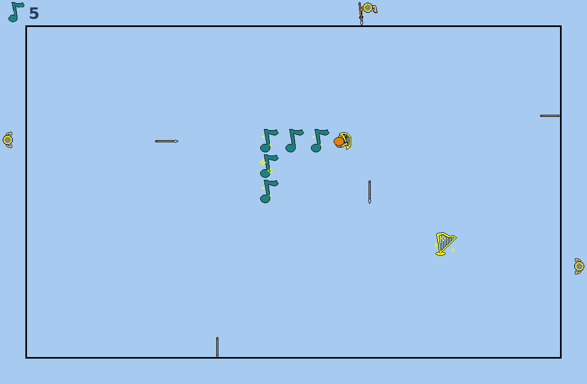

# David Snake — Android

A faithful Android port of *david_snake*, a 2012 C# WinForms game. It looks
like Snake, but David is being ambushed: while he collects golden harps and
trails a line of musical notes behind him, spear-throwers appear along the
walls, take aim just ahead of where he's going, and let fly.

## Get the APK on your phone

1. Create a new **public** GitHub repository.
2. Extract this zip and upload **all of its contents to the repository root** —
   including the `.github` folder. The file `.github/workflows/build.yml` must
   end up at exactly that path, or the build won't trigger.
3. Commit. GitHub Actions builds the app automatically (2–4 minutes — watch
   the **Actions** tab).
4. Open **Releases** → **David Snake — latest build** → download
   **david-snake.apk** on your phone and open it. Android will ask you to
   allow installs from your browser ("install unknown apps") the first time.

Every later commit rebuilds the APK and refreshes the same `latest` release.
The debug signing key is committed with the project, so new builds install
straight over the old one — no uninstalling.

## How to play

Swipe anywhere to steer — each gesture turns David exactly once: the
first one instantly, the next one queued for right after his next step.
A gesture ends when the finger lifts, stops in place, or bends sharply,
so you can carve zigzags in one continuous drag. Tap to start, and to
retry after a loss.
Collect harps to grow your trail of notes. Spears kill only on a head hit;
they pass over your tail and stick into the far wall (six at most — the
oldest falls out). When you're pressed against a wall you get a beat to
swipe away before it's over. Attackers always throw from the wall on your far side, aiming one
cell ahead of you. Waves come faster and larger the longer you survive.

And yes — after you fall, they keep throwing. The original did that too.

## Project notes

Plain Kotlin with zero dependencies: one Activity, a custom Canvas view,
and all UI built in code (no layout XML). The game logic lives in
`GameEngine.kt`, a line-faithful port of the original's `Form1.cs`,
`figure.cs`, `attaker.cs` and `math.cs`, preserving its tick structure
(the snake steps every 4th tick, spears move every tick, and a swipe
rotates the head instantly while movement stays on the step schedule,
with at most one physical rotation per movement plus one queued turn)
at a relaxed
mobile pace, locked to the original's hard difficulty, and its quirks —
including the difficulty-scaled wall-grace window and the post-death spear
rain. One genuine bug in the original was fixed (the harp could briefly
respawn under the first tail segment) and is flagged with a comment. The
sprites are the original 48-pixel bitmaps, converted to transparent PNGs
and drawn with nearest-neighbor scaling so they stay crisp. The engine was
validated headlessly with ~600k simulated ticks (1.8M assertions) across
all difficulties — the simulator is in `tools/sim/Sim.kt`.

There is intentionally no Gradle wrapper: the workflow installs Gradle 8.7
on JDK 17 (AGP 8.5.2, compileSdk 34, minSdk 26). To build locally instead,
install Gradle 8.7 and the Android SDK, then run `gradle assembleDebug`.

Original game and artwork by the original author, 2012. This port keeps
both intact.
