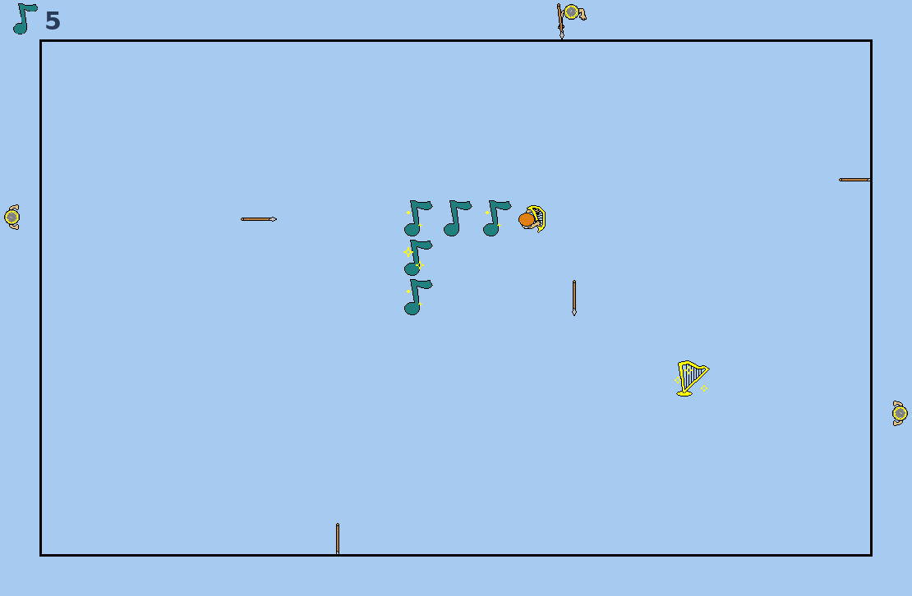

# David Snake — Android

A faithful Android port of *david_snake*, a 2012 C# WinForms game. It looks
like Snake, but David is being ambushed: while he collects golden harps and
trails a line of musical notes behind him, spear-throwers appear along the
walls, take aim just ahead of where he's going, and let fly.

## Get the APK on your phone

1. Create a new **public** GitHub repository.
2. Extract this zip and upload **all of its contents to the repository root** —
   including the `.github` folder. The file `.github/workflows/build.yml` must
   end up at exactly that path, or the build won't trigger.
3. Commit. GitHub Actions builds the app automatically (2–4 minutes — watch
   the **Actions** tab).
4. Open **Releases** → **David Snake — latest build** → download
   **david-snake.apk** on your phone and open it. Android will ask you to
   allow installs from your browser ("install unknown apps") the first time.

Every later commit rebuilds the APK and refreshes the same `latest` release.
The debug signing key is committed with the project, so new builds install
straight over the old one — no uninstalling.

## How to play

Swipe anywhere to steer: up, down, left or right on the screen. A turn
moves David a step right away; keep dragging and every further 42dp is
another command, so you can carve zigzags in one continuous drag. Swiping
straight back the way he came makes a U-turn (a step to the side, then
back). A quick flick shorter than that counts too, when the finger lifts.
Tap to start, and to retry after a loss. The build number is in
the top-right corner.
Collect harps to grow your trail of notes. Spears kill only on a head hit;
they pass over your tail and stick into the far wall (six at most — the
oldest falls out). When you're pressed against a wall you get a beat to
swipe away before it's over. Attackers always throw from the wall on your far side, aiming one
cell ahead of you. Waves come faster and larger the longer you survive.

And yes — after you fall, they keep throwing. The original did that too.

## Input test (debug mode)

Drag along the very top edge of the screen from one side to the other:
debug mode turns on (same gesture turns it off; it is always off when the
app starts) and a recorded test starts. The top-right corner names the input variant and counts the
games.

- Double-tap whenever an input went wrong (a swipe ignored, or a turn you
  did not mean); "FLAGGED" confirms it. It marks what you did in the
  1.5 seconds before; doing it right after dying is fine.
- Every game is appended to
  `Downloads/DavidSnake_InputLab_v<version>_<date>.txt`; at the end the
  screen says *Testing done*. Analyze with `python3 tools/lab_report.py FILE`.

Leaving debug mode keeps the test where it was; turning it on again
resumes it. Once a test is done, turning debug mode on starts a new one.

The first test (v1.1.50: the original input, a new heading-relative
reader with step-on-turn, and the same reader with beat-timed movement,
three games each) found the original input best for long continuous
drags; beat-timed movement did worst. The original's only flagged
failures were blocked backward swipes, now U-turns; short flicks now
count on lift (`O-PLUS`, the default). The current test is three recorded games of `O-PLUS`.

## Project notes

Plain Kotlin with zero dependencies: one Activity, a custom Canvas view,
and all UI built in code (no layout XML). The game logic lives in
`GameEngine.kt`, a line-faithful port of the original's `Form1.cs`,
`figure.cs`, `attaker.cs` and `math.cs`, preserving its tick structure
(the snake steps every 4th tick and spears move every tick; a turn
executes either as the original's immediate step or in a metronome mode
with one instant rotation per movement plus one queued turn, see
`TurnMode`) at a relaxed
mobile pace, locked to the original's hard difficulty, and its quirks —
including the difficulty-scaled wall-grace window and the post-death spear
rain. One genuine bug in the original was fixed (the harp could briefly
respawn under the first tail segment) and is flagged with a comment. The
sprites are the original 48-pixel bitmaps, converted to transparent PNGs
and drawn with nearest-neighbor scaling so they stay crisp. The engine was
validated headlessly with ~600k simulated ticks (1.8M assertions) across
all difficulties — the simulator is in `tools/sim/Sim.kt`.

There is intentionally no Gradle wrapper: the workflow installs Gradle 8.7
on JDK 17 (AGP 8.5.2, compileSdk 34, minSdk 26). To build locally instead,
install Gradle 8.7 and the Android SDK, then run `gradle assembleDebug`.

Original game and artwork by the original author, 2012. This port keeps
both intact.
